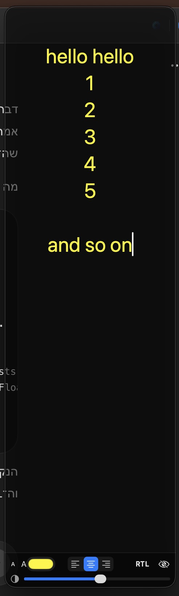

# FloatText

A lightweight floating text overlay for macOS. Designed as a conversational cue sheet — keep prompts, talking points, and reminders visible above other windows during live calls and recordings.

Native Swift + SwiftUI + AppKit. `NSTextView` under the hood for stable Hebrew / RTL editing.

## Status

MVP (v0.2). Local builds only — no signing, no notarization, no App Store. Runs on macOS 14 Sonoma or later. See [CHANGELOG.md](CHANGELOG.md) for what's new.

## Screenshot



## What FloatText is

- A small translucent floating panel that stays above other apps
- A quick place to read from, copy from, and edit during a live conversation
- Local-only — nothing leaves your machine

## What FloatText is not

- Not a note-taking app
- Not a document editor
- Not a markdown renderer
- Not synced — no iCloud, no accounts, no cloud
- Not (yet) a notarized public release

## Features

- **Multiple windows.** Open as many floating panels as you need; each has its own text, frame, font size, color, alignment, and RTL state.
- Frameless floating panel that stays above other windows (Always on Top toggle)
- Editable multiline `NSTextView` with Hebrew / RTL support
- All smart-quote / auto-substitution / auto-correct disabled — keeps Hebrew punctuation stable
- Standard copy / paste / cut / undo
- Text alignment: left / center / right
- RTL ↔ LTR toggle
- Font size + / −
- Text color picker
- Background opacity slider — real transparency, see through to the windows beneath
- Focus Mode — hides the controls bar; text stays editable; hover the panel to reveal controls
- Click-through Mode — clicks pass through to apps beneath (reversible from the menu bar icon; see Known limitations)
- Menu bar icon with Show All / Hide All / New / Hide / Delete / Clear, plus mode toggles and Quit
- Hide Dock Icon toggle
- Launch at Login toggle
- Local persistence of every window's text, frame, font size, color, opacity, alignment, RTL state, and toggles
- First-launch seed text with a short Hebrew conversation structure

## Window management

FloatText distinguishes carefully between **non-destructive** and **destructive** window actions. Nothing destructive happens without an explicit confirmation dialog.

### Action semantics

| Action | Destructive? | What happens to the panel | What happens to text & state | How to restore |
|---|---|---|---|---|
| **Hide Window** | No | Disappears from the screen | All preserved | Show All Windows |
| **Hide All Windows** | No | Every visible panel `orderOut` | All preserved | Show All Windows |
| **Show All Windows** | No | Reveals every hidden panel; if there are zero windows, creates one new blank panel so you can never reach a dead end | n/a | n/a |
| **New Window** | No | A fresh blank panel appears | New empty `WindowState` | n/a |
| **Clear Note** | Yes (text only) | Panel stays open at same size / position | Only the text is removed; color, opacity, alignment, RTL, frame all preserved | Cannot — but the window itself is intact |
| **Delete Window** | Yes (window) | Panel disappears and is removed from the active set | Text, frame, color, opacity, alignment, RTL — all permanently removed | Cannot — gone |

### In-window top controls

The top of each panel has a small split header. Destructive on the left, safer on the right:

| Side | Icon | Action |
|---|---|---|
| Left | 🗑 `trash` (red) | **Delete Window** — opens a confirmation dialog. Cancel by default. |
| Right | ➕ `plus` | **New Window** |
| Right | 👁 `eye.slash` | **Hide Window** — safe, no confirmation |
| Right | 🧹 `eraser.fill` | **Clear Note** — opens a confirmation dialog before wiping just the text |

The top header stays visible in Focus Mode (the bottom formatting bar hides; window-management stays reachable). When Click-through Mode is on the entire panel ignores mouse events, so both bars are hidden — that absence is the visible state indicator. Recover via the menu bar.

### Bottom controls bar (formatting / reading only)

The bottom bar carries no window-management buttons — only:

- A− / A+ font size
- Text color picker
- Alignment (left / center / right)
- RTL / LTR toggle
- Focus Mode toggle
- Background opacity slider

### Menu bar

```
Show All Windows                       ⌘⇧H
Hide All Windows
─────────
New Window                             ⌘N
Hide Current Window                    ⌘W
Delete Current Window…                 (NSAlert confirmation)
Clear Current Note…                    (NSAlert confirmation)
─────────
Focus Mode  (per active window)        ⌘⇧F
Always on Top  (global)
Click-through Mode  (per active window)
Disable Click-through (All Windows)    (appears only when needed)
─────────
RTL  (per active window)               ⌘⇧R
─────────
Hide Dock Icon  (global)
Launch at Login  (global)
─────────
Quit FloatText                         ⌘Q
```

Per-window menu items operate on the **active window** — the most recently focused / clicked panel. Global items affect the whole app.

## Install

```bash
git clone https://github.com/<your-user>/FloatText.git
cd FloatText
./scripts/install.sh
open ~/Applications/FloatText.app
```

To install for all users in `/Applications` (sudo):

```bash
./scripts/install.sh --system
```

The script builds in Release, stops any running FloatText, replaces an existing install if present, and registers the new `.app` with LaunchServices. Re-run after any code change — installs are idempotent.

## Uninstall

```bash
./scripts/uninstall.sh             # remove from ~/Applications, keep settings
./scripts/uninstall.sh --system    # remove from /Applications (sudo)
./scripts/uninstall.sh --purge     # also delete UserDefaults (saved text,
                                   # window positions, colors, font sizes, etc.)
```

`--system` and `--purge` may be combined.

## Build from source

Requires Xcode 15+ on macOS 14 or later.

```bash
./scripts/open.sh    # opens FloatText.xcodeproj in Xcode
```

Then ⌘R.

> If Cursor, AppCode, or another editor has registered itself as the default opener for `.xcodeproj`, `open.sh` forces Xcode via `open -b com.apple.dt.Xcode`. To do it manually: `open -a Xcode FloatText.xcodeproj`.

A `Package.swift` is included for `swift build` / `swift run`, but those produce a bare CLI binary rather than a `.app` bundle — for the menu bar and floating panel behavior to work, use Xcode or `install.sh`.

## Keyboard shortcuts

- ⌘⇧H — Show All Windows
- ⌘N  — New Window
- ⌘W  — Hide Current Window
- ⌘⇧F — Toggle Focus Mode (active window)
- ⌘⇧R — Toggle RTL / LTR (active window)
- ⌘Q  — Quit
- Standard ⌘C / ⌘V / ⌘X / ⌘Z / ⌘A inside the text view

Delete Current Window and Clear Current Note are intentionally without shortcuts and require confirmation.

## Known limitations

- **Unsigned local builds only.** No code signing, no notarization, no sandbox. Distributing the built `.app` to another Mac will trigger a Gatekeeper warning.
- **Launch at Login** uses `SMAppService`, which expects the app to live at a stable install location. From an unsigned development build it may report `.notRegistered` even after enabling — install via `install.sh` first.
- **Click-through Mode is still being tested and may need further hardening.** The AppKit API (`panel.ignoresMouseEvents`) is correct and the rescue path (`Disable Click-through (All Windows)` menu item) prevents trap states, but real-world pass-through reliability has not been fully verified across macOS versions yet.
- **No global hotkey** for show/hide. The menu bar icon is the always-available entry point.
- **Closed-but-orphaned UserDefaults from earlier `Close Window` semantics** (pre-v0.2) may still be present in `com.floattext.FloatText` — they don't affect behavior and `./scripts/uninstall.sh --purge` removes everything. The current v0.2 `Hide` / `Delete` actions don't create orphans.
- **Narrow panels + large text** can wrap awkwardly. Either widen the panel or reduce font size to taste.

## Privacy

- Zero network traffic
- No analytics, no telemetry
- No accounts, no cloud, no sync
- All persisted state lives in `UserDefaults` under `com.floattext.FloatText`

## Architecture

```
Sources/FloatText/
├── FloatTextApp.swift             @main + AppDelegate + MenuBarExtra
├── AppState.swift                 Global settings + windows[] + legacy-key migration
├── WindowState.swift              Per-window @Published state (text, frame, color, …)
├── WindowManager.swift            Owns [FloatingPanelController]; new/hide/delete/show
├── FloatingPanel.swift            NSPanel subclass — activating, floating, borderless feel
├── FloatingPanelController.swift  Wires one panel to its WindowState; observes state
├── OverlayView.swift              SwiftUI root: top header (manage) + text + bottom bar
├── ControlsBar.swift              Bottom formatting bar only (A-/A+, color, align, RTL, focus, opacity)
├── RTLTextView.swift              NSViewRepresentable around NSTextView (RTL-stable)
├── MenuBarMenu.swift              MenuBarExtra contents
└── LaunchAtLogin.swift            SMAppService wrapper
```

See [docs/design-notes.md](docs/design-notes.md) for rationale on the panel choice, the NSTextView decision, and RTL handling.

## Roadmap

- Signed / notarized Developer ID build
- Click-through hardening across macOS versions
- Global hotkey for Show All / Hide All
- Optional read-only / teleprompter scroll mode
- Reopen-Deleted recovery (currently Delete is final)

## License

No license file yet. Treat as all rights reserved until one is added.
